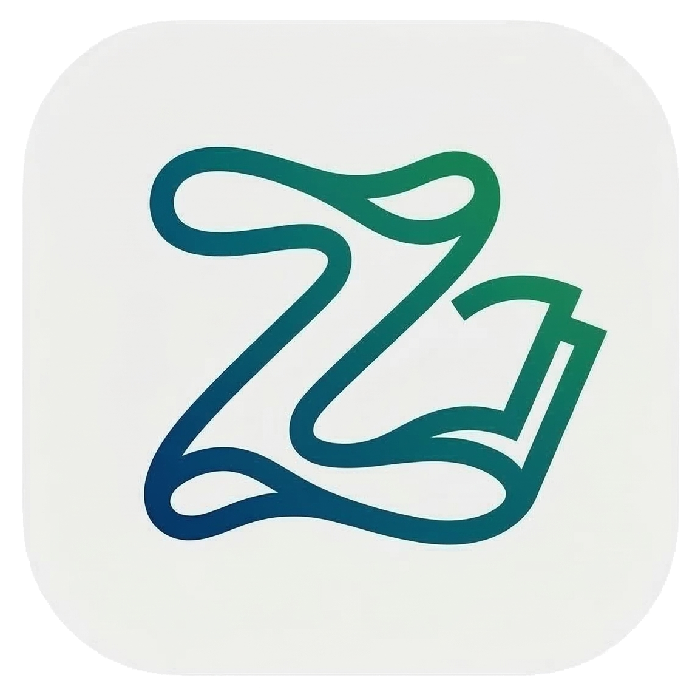
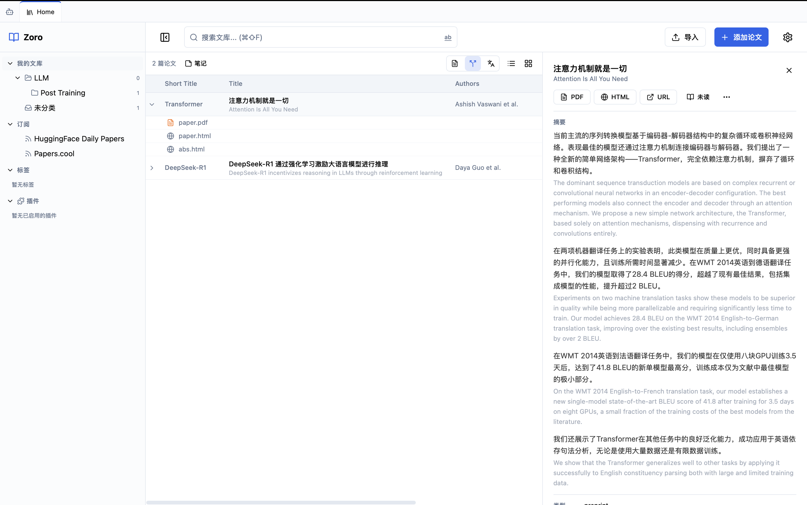
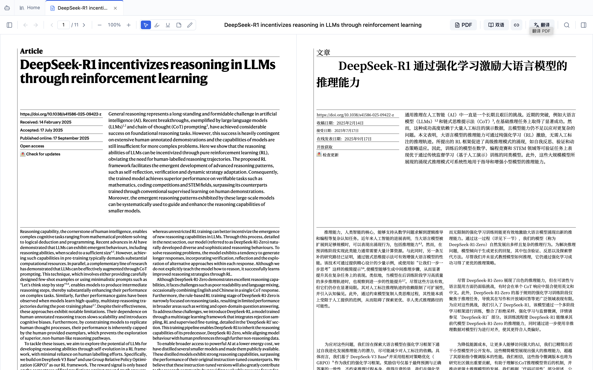
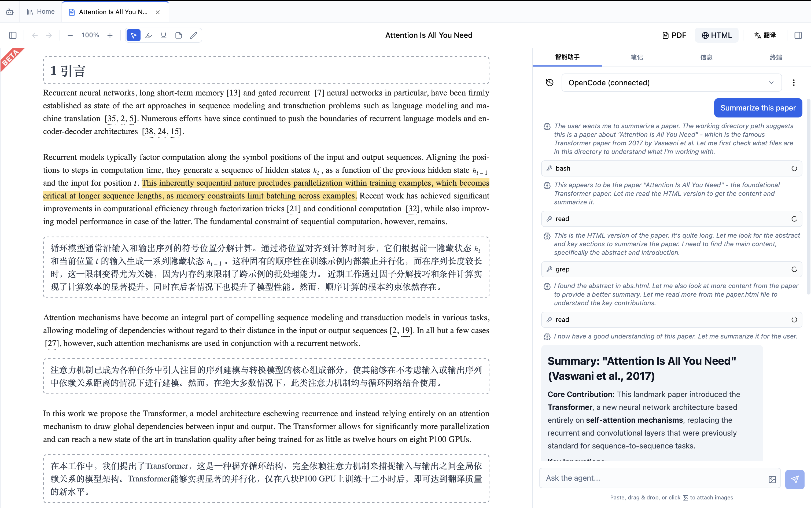
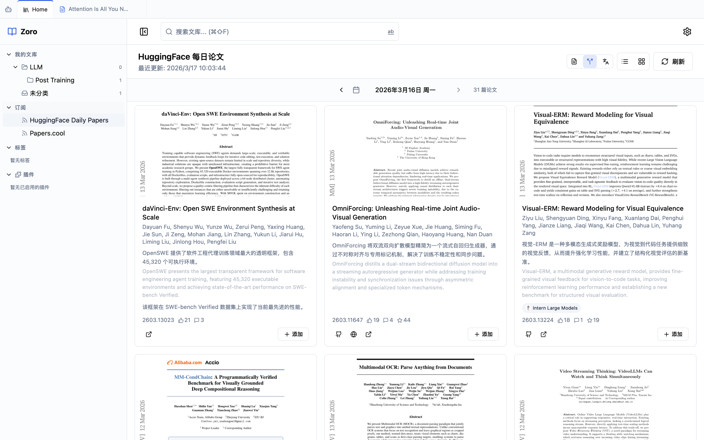

<p align="center">
  
  <h1 align="center">Zoro</h1>
  <p align="center"><strong>Read papers in your language. Let AI manage your library.</strong></p>
  <p align="center">
    <a href="./README.zh-CN.md">中文</a> · <a href="https://github.com/ruihanglix/zoro/releases">Download</a> · <a href="./docs/development.md">Development</a>
  </p>
</p>

Zoro is an AI-native literature management tool built for non-English-speaking researchers and the age of AI agents. From the very first line of code, **native-language reading** and **AI agent collaboration** are core design principles, not afterthoughts.

> Cross-platform desktop app (macOS / Windows / Linux). Local-first. Your data stays yours.

<p align="center">
  
</p>

---

## Download

Download the installer for your platform from the [Releases](https://github.com/ruihanglix/zoro/releases) page:

| Platform | File |
|---|---|
| macOS (Apple Silicon) | `Zoro_x.x.x_aarch64.dmg` |
| macOS (Intel) | `Zoro_x.x.x_x64.dmg` |
| Windows | `Zoro_x.x.x_x64-setup.exe` |
| Linux (Debian/Ubuntu) | `Zoro_x.x.x_amd64.deb` |
| Linux (AppImage) | `Zoro_x.x.x_amd64.AppImage` |

> Want to build from source? See the [Development Guide](./docs/development.md).

---

## Highlights

### 🌏 Native Language — Read Every Paper in Your Mother Tongue

Most reference managers treat translation as a checkbox feature. Zoro weaves native-language reading into every surface of the app.

**Three display modes, one click** — Original / Bilingual / Translated. Applies globally across paper lists, abstracts, and detail views. Titles and abstracts are auto-translated with an immersive bilingual layout — translation displayed prominently, original below.

<p align="center">
  
</p>

**Side-by-side bilingual PDF reader** — Original PDF on the left, translated PDF on the right, synchronized scrolling. Both sides support highlights, annotations, and ink notes.

<p align="center">
  
</p>

**Full-text HTML translation** — ArXiv HTML papers are translated paragraph by paragraph in the background, with real-time progress. Read while it translates.

<p align="center">
  
</p>

**Bilingual subscription feeds** — Browse HuggingFace Daily Papers and other feeds in bilingual mode to quickly triage what's worth reading.

<p align="center">
  
</p>

All translations are cached locally — open a paper again and it's instant.

---

### 🤖 Agent-Native — Your Library, Accessible to AI

Zoro is designed from the storage layer to the protocol layer for AI agents.

**Built-in AI Assistant** — In-app agent panel with multi-turn conversations. Ask questions, summarize, translate, or analyze the current paper directly. Supports image input, tool calls, and chain-of-thought display.

**MCP Server** — Built-in [Model Context Protocol](https://modelcontextprotocol.io/) server with ~35 tools. Claude Desktop, Cursor, OpenCode, and other AI tools can search, browse, and manage your papers. One toggle in Settings to enable. See the [MCP Server docs](./docs/mcp-server.md) for details.

**The Filesystem Is the API** — Every paper lives in its own directory with a structured `metadata.json`. AI agents can read your library by simply navigating the filesystem — no special SDK needed. The `attachments/` directory is agent-writable, allowing agents to generate summaries, translations, and reports.

```
~/.zoro/library/papers/
  2017-attention-is-all-you-need-a1b2c3d4/
    metadata.json          ← Structured metadata, directly readable by agents
    paper.pdf              ← PDF full text
    abs.html               ← HTML full text
    attachments/           ← Agent-writable
      summary.md           ← AI-generated summary
      translation-zh.md    ← AI-generated translation
    notes/                 ← User notes
```

---

## More Features

- **Zotero Import** — Import your existing Zotero library including papers, collections, tags, and metadata. Migrate seamlessly without losing any data
- **WebDAV Sync** — Sync your library across devices via any WebDAV service. Conflict-free, encrypted, you own the server
- **Full-featured PDF Reader** — Highlights, underlines, sticky notes, freehand ink, outline navigation, citation hover preview
- **Browser Extension** — Chrome extension to save papers with one click from ArXiv, DOI pages, and any academic site. [Zotero Connector compatible](./docs/browser-extension.md)
- **Import & Export** — BibTeX / RIS format support, drag-and-drop PDF import, formatted citation output (APA, IEEE, MLA, Chicago)
- **Local-first & Private** — SQLite database, all data stored locally, works offline. Paper data never leaves your machine
- **Cross-platform** — Native on macOS, Windows, and Linux

---

## License

[AGPL-3.0](./LICENSE)
